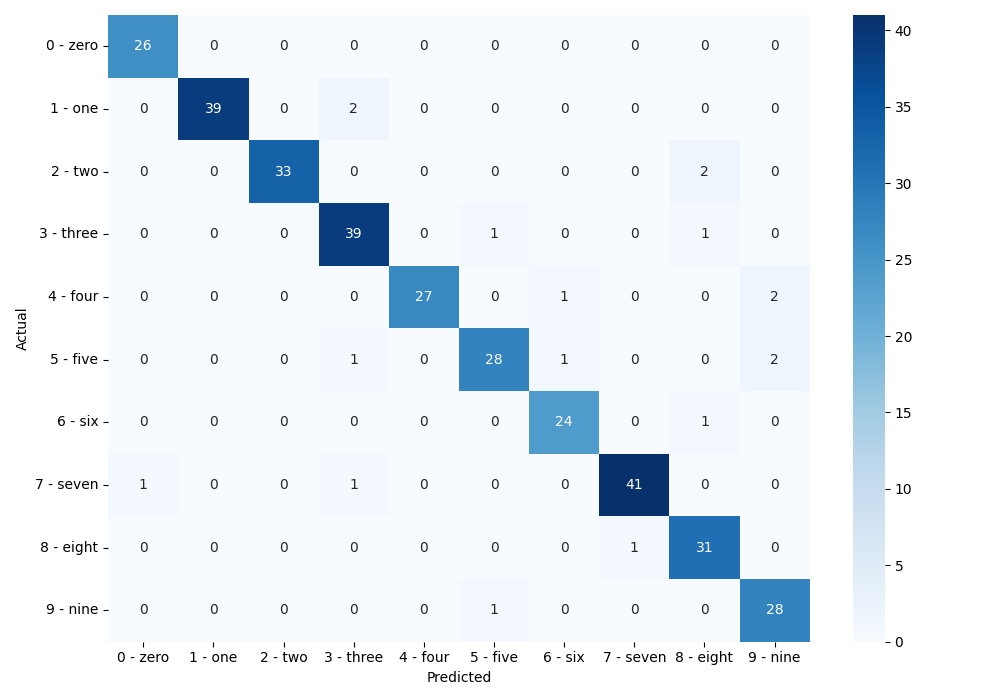

# resnet18
resnet18のpytorch実装です[^1]。

## mnistの分類
cpuでも実行できます。
```bash
python mnist.py
```
5epoch目で、テストデータに対して精度94.61%を達成できました。


## cifar-10
gpuの使用推奨です。
```bash
python cifar-10.py
```
58epoch目で、テストデータに対して精度86.36%を達成できました。


[^1]:[He, K., Zhang, X., Ren, S., & Sun, J. (2016). Deep residual learning for image recognition. In Proceedings of the IEEE conference on computer vision and pattern recognition (pp. 770-778).](https://openaccess.thecvf.com/content_cvpr_2016/html/He_Deep_Residual_Learning_CVPR_2016_paper.html)
